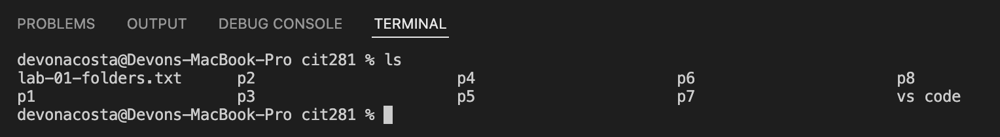
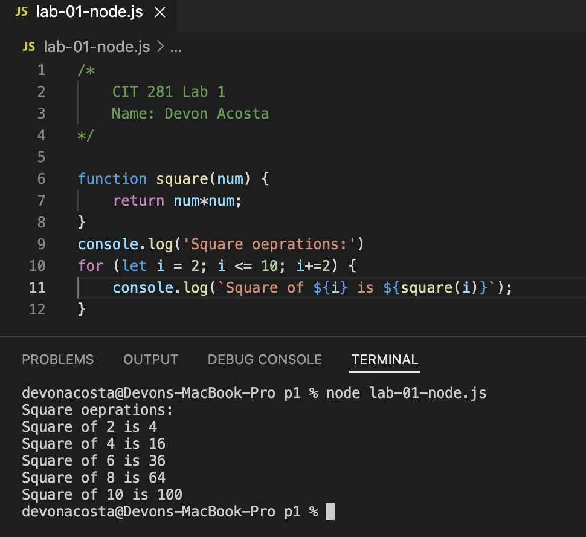

# cit281-lab1

## Lab Goals and Objectives
1. Install and setup your personal computer with the software tools required for this course
2. Practice using software tools
3. Practice terminal or shell commands
4. Practice keyboard shortcuts
5. Create your first Node.js server-side JavaScript file

### Lab Deliverables

[lab-01-folders.txt](lab-01-folders.txt)
[lab-01.shortcuts.txt](lab-01.shortcuts.txt)
[lab-01-node.js](lab-01-node.js)

